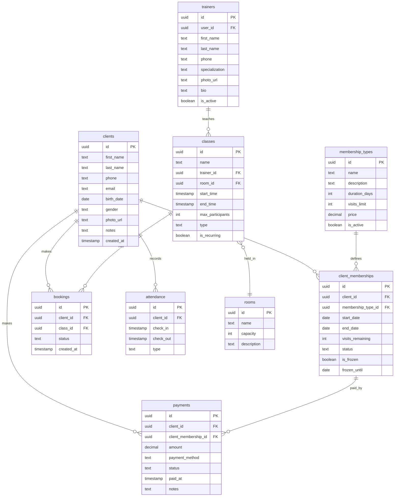

# Схема базы данных

## ER-диаграмма



## Описание таблиц

### clients — Клиенты

Основная таблица с данными клиентов фитнес-клуба.

| Поле | Тип | Описание |
|------|-----|----------|
| `id` | uuid | Уникальный идентификатор (PK) |
| `first_name` | text | Имя |
| `last_name` | text | Фамилия |
| `phone` | text | Телефон (уникальный) |
| `email` | text | Email (опционально) |
| `birth_date` | date | Дата рождения |
| `gender` | text | Пол: male / female |
| `photo_url` | text | Ссылка на фото |
| `notes` | text | Заметки менеджера |
| `created_at` | timestamp | Дата регистрации |

### membership_types — Типы абонементов

Шаблоны абонементов, которые продаёт клуб.

| Поле | Тип | Описание |
|------|-----|----------|
| `id` | uuid | PK |
| `name` | text | Название ("Безлимит 30 дней", "8 посещений") |
| `description` | text | Описание |
| `duration_days` | int | Срок действия в днях |
| `visits_limit` | int | Лимит посещений (null = безлимит) |
| `price` | decimal | Цена |
| `is_active` | boolean | Продаётся ли сейчас |

### client_memberships — Абонементы клиентов

Конкретные абонементы, привязанные к клиентам.

| Поле | Тип | Описание |
|------|-----|----------|
| `id` | uuid | PK |
| `client_id` | uuid | FK → clients |
| `membership_type_id` | uuid | FK → membership_types |
| `start_date` | date | Дата начала |
| `end_date` | date | Дата окончания |
| `visits_remaining` | int | Оставшиеся посещения |
| `status` | text | active / expired / cancelled |
| `is_frozen` | boolean | Заморожен ли |
| `frozen_until` | date | Заморожен до даты |

### trainers — Тренеры

| Поле | Тип | Описание |
|------|-----|----------|
| `id` | uuid | PK |
| `user_id` | uuid | FK → auth.users (для входа в систему) |
| `first_name` | text | Имя |
| `last_name` | text | Фамилия |
| `phone` | text | Телефон |
| `specialization` | text | Специализация (фитнес, йога, бокс...) |
| `photo_url` | text | Фото |
| `bio` | text | Описание / опыт |
| `is_active` | boolean | Работает ли сейчас |

### classes — Занятия

| Поле | Тип | Описание |
|------|-----|----------|
| `id` | uuid | PK |
| `name` | text | Название занятия |
| `trainer_id` | uuid | FK → trainers |
| `room_id` | uuid | FK → rooms |
| `start_time` | timestamp | Начало |
| `end_time` | timestamp | Конец |
| `max_participants` | int | Максимум участников |
| `type` | text | group / personal |
| `is_recurring` | boolean | Повторяющееся |

### bookings — Бронирования

| Поле | Тип | Описание |
|------|-----|----------|
| `id` | uuid | PK |
| `client_id` | uuid | FK → clients |
| `class_id` | uuid | FK → classes |
| `status` | text | confirmed / cancelled / attended |
| `created_at` | timestamp | Дата бронирования |

### attendance — Посещаемость

| Поле | Тип | Описание |
|------|-----|----------|
| `id` | uuid | PK |
| `client_id` | uuid | FK → clients |
| `check_in` | timestamp | Время входа |
| `check_out` | timestamp | Время выхода |
| `type` | text | gym / class / pool |

### payments — Платежи

| Поле | Тип | Описание |
|------|-----|----------|
| `id` | uuid | PK |
| `client_id` | uuid | FK → clients |
| `client_membership_id` | uuid | FK → client_memberships |
| `amount` | decimal | Сумма |
| `payment_method` | text | cash / card / transfer |
| `status` | text | completed / pending / refunded |
| `paid_at` | timestamp | Дата оплаты |
| `notes` | text | Комментарий |

### rooms — Залы

| Поле | Тип | Описание |
|------|-----|----------|
| `id` | uuid | PK |
| `name` | text | Название зала |
| `capacity` | int | Вместимость |
| `description` | text | Описание / оборудование |

## SQL для создания таблиц

<Accordion title="SQL-миграция (Supabase)">

```sql
-- Клиенты
CREATE TABLE clients (
    id UUID DEFAULT gen_random_uuid() PRIMARY KEY,
    first_name TEXT NOT NULL,
    last_name TEXT NOT NULL,
    phone TEXT UNIQUE NOT NULL,
    email TEXT,
    birth_date DATE,
    gender TEXT CHECK (gender IN ('male', 'female')),
    photo_url TEXT,
    notes TEXT,
    created_at TIMESTAMPTZ DEFAULT NOW()
);

-- Типы абонементов
CREATE TABLE membership_types (
    id UUID DEFAULT gen_random_uuid() PRIMARY KEY,
    name TEXT NOT NULL,
    description TEXT,
    duration_days INT NOT NULL,
    visits_limit INT,
    price DECIMAL(10,2) NOT NULL,
    is_active BOOLEAN DEFAULT TRUE,
    created_at TIMESTAMPTZ DEFAULT NOW()
);

-- Абонементы клиентов
CREATE TABLE client_memberships (
    id UUID DEFAULT gen_random_uuid() PRIMARY KEY,
    client_id UUID REFERENCES clients(id) ON DELETE CASCADE,
    membership_type_id UUID REFERENCES membership_types(id),
    start_date DATE NOT NULL,
    end_date DATE NOT NULL,
    visits_remaining INT,
    status TEXT DEFAULT 'active' CHECK (status IN ('active', 'expired', 'cancelled')),
    is_frozen BOOLEAN DEFAULT FALSE,
    frozen_until DATE,
    created_at TIMESTAMPTZ DEFAULT NOW()
);

-- Залы
CREATE TABLE rooms (
    id UUID DEFAULT gen_random_uuid() PRIMARY KEY,
    name TEXT NOT NULL,
    capacity INT NOT NULL,
    description TEXT
);

-- Тренеры
CREATE TABLE trainers (
    id UUID DEFAULT gen_random_uuid() PRIMARY KEY,
    user_id UUID REFERENCES auth.users(id),
    first_name TEXT NOT NULL,
    last_name TEXT NOT NULL,
    phone TEXT,
    specialization TEXT,
    photo_url TEXT,
    bio TEXT,
    is_active BOOLEAN DEFAULT TRUE,
    created_at TIMESTAMPTZ DEFAULT NOW()
);

-- Занятия
CREATE TABLE classes (
    id UUID DEFAULT gen_random_uuid() PRIMARY KEY,
    name TEXT NOT NULL,
    trainer_id UUID REFERENCES trainers(id),
    room_id UUID REFERENCES rooms(id),
    start_time TIMESTAMPTZ NOT NULL,
    end_time TIMESTAMPTZ NOT NULL,
    max_participants INT DEFAULT 20,
    type TEXT DEFAULT 'group' CHECK (type IN ('group', 'personal')),
    is_recurring BOOLEAN DEFAULT FALSE,
    created_at TIMESTAMPTZ DEFAULT NOW()
);

-- Бронирования
CREATE TABLE bookings (
    id UUID DEFAULT gen_random_uuid() PRIMARY KEY,
    client_id UUID REFERENCES clients(id) ON DELETE CASCADE,
    class_id UUID REFERENCES classes(id) ON DELETE CASCADE,
    status TEXT DEFAULT 'confirmed' CHECK (status IN ('confirmed', 'cancelled', 'attended')),
    created_at TIMESTAMPTZ DEFAULT NOW(),
    UNIQUE(client_id, class_id)
);

-- Посещаемость
CREATE TABLE attendance (
    id UUID DEFAULT gen_random_uuid() PRIMARY KEY,
    client_id UUID REFERENCES clients(id) ON DELETE CASCADE,
    check_in TIMESTAMPTZ DEFAULT NOW(),
    check_out TIMESTAMPTZ,
    type TEXT DEFAULT 'gym' CHECK (type IN ('gym', 'class', 'pool'))
);

-- Платежи
CREATE TABLE payments (
    id UUID DEFAULT gen_random_uuid() PRIMARY KEY,
    client_id UUID REFERENCES clients(id) ON DELETE CASCADE,
    client_membership_id UUID REFERENCES client_memberships(id),
    amount DECIMAL(10,2) NOT NULL,
    payment_method TEXT CHECK (payment_method IN ('cash', 'card', 'transfer')),
    status TEXT DEFAULT 'completed' CHECK (status IN ('completed', 'pending', 'refunded')),
    paid_at TIMESTAMPTZ DEFAULT NOW(),
    notes TEXT
);

-- Индексы для производительности
CREATE INDEX idx_clients_phone ON clients(phone);
CREATE INDEX idx_client_memberships_client ON client_memberships(client_id);
CREATE INDEX idx_client_memberships_status ON client_memberships(status);
CREATE INDEX idx_classes_start_time ON classes(start_time);
CREATE INDEX idx_bookings_client ON bookings(client_id);
CREATE INDEX idx_bookings_class ON bookings(class_id);
CREATE INDEX idx_attendance_client ON attendance(client_id);
CREATE INDEX idx_payments_client ON payments(client_id);
```

</Accordion>
