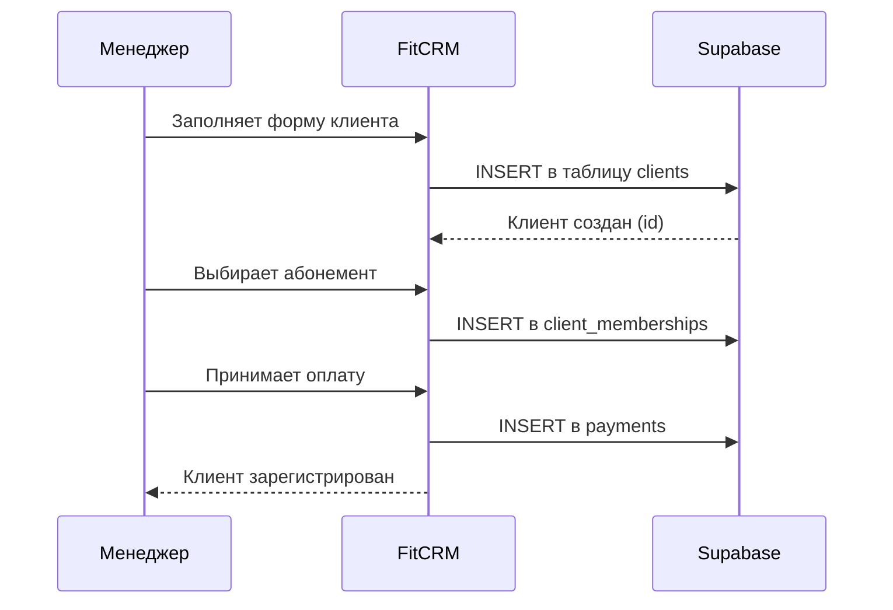
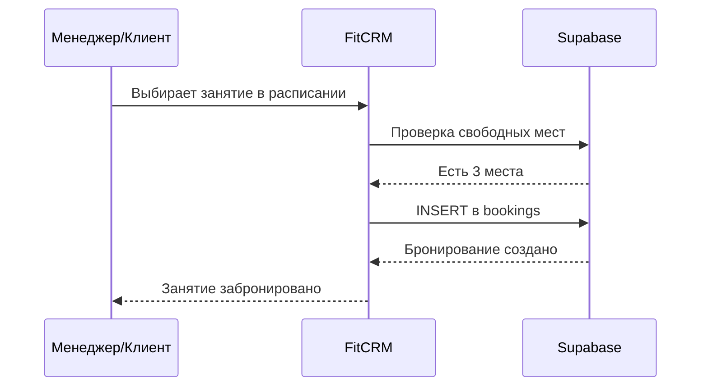

# Обзор архитектуры

## Структура приложения

```
fitcrm/
├── app/                      # Next.js App Router
│   ├── (auth)/               # Страницы авторизации
│   │   ├── login/
│   │   └── register/
│   ├── (dashboard)/          # Основное приложение (требует авторизации)
│   │   ├── page.tsx          # Дашборд — главная страница
│   │   ├── clients/          # Управление клиентами
│   │   │   ├── page.tsx      # Список клиентов
│   │   │   └── [id]/page.tsx # Карточка клиента
│   │   ├── memberships/      # Абонементы
│   │   ├── schedule/         # Расписание
│   │   ├── trainers/         # Тренеры
│   │   ├── payments/         # Платежи
│   │   └── analytics/        # Аналитика
│   ├── api/                  # API-маршруты
│   └── layout.tsx            # Общий layout
├── components/               # Переиспользуемые компоненты
│   ├── ui/                   # shadcn/ui компоненты
│   ├── forms/                # Формы (клиент, абонемент, занятие)
│   ├── tables/               # Таблицы данных
│   └── charts/               # Графики
├── lib/                      # Утилиты
│   ├── supabase/             # Клиент Supabase
│   ├── utils.ts              # Общие утилиты
│   └── types.ts              # TypeScript типы
└── public/                   # Статические файлы
```

## Роли пользователей

| Роль | Доступ |
|------|--------|
| **Администратор** | Полный доступ: клиенты, платежи, настройки, аналитика |
| **Менеджер** | Клиенты, абонементы, расписание (без финансов и настроек) |
| **Тренер** | Своё расписание, список участников своих занятий |

## Ключевые потоки данных

### Регистрация нового клиента


### Бронирование занятия


## Безопасность

- **Row Level Security (RLS)** — каждый пользователь видит только данные, к которым имеет доступ
- **JWT-аутентификация** через Supabase Auth
- **HTTPS** — весь трафик шифруется (обеспечивается Vercel)
- **Валидация данных** — на фронтенде (Zod) и в БД (constraints)
