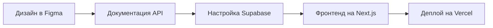

# Быстрый старт

## Что понадобится

### Аккаунты (бесплатно)

<CardGroup cols={3}>
  <Card title="GitHub" icon="github">
    Хранение кода
  </Card>
  <Card title="Supabase" icon="database">
    Бэкенд и база данных
  </Card>
  <Card title="Vercel" icon="globe">
    Хостинг приложения
  </Card>
</CardGroup>

### Инструменты

| Инструмент | Для чего |
|-----------|----------|
| Node.js 18+ | Запуск приложения |
| Git | Контроль версий |
| VS Code | Редактор кода |
| Figma | Дизайн макетов |

## Дизайн-задачи (для вас)

Перед началом кодирования подготовьте в Figma:

<Steps>
  <Step title="Дашборд">
    Главная страница с ключевыми метриками: кол-во клиентов, активные абонементы, выручка за месяц, ближайшие занятия
  </Step>
  <Step title="Список клиентов">
    Таблица с поиском, фильтрами, сортировкой. Колонки: имя, телефон, абонемент, статус, последнее посещение
  </Step>
  <Step title="Карточка клиента">
    Полная информация: контакты, история абонементов, посещения, платежи
  </Step>
  <Step title="Расписание">
    Календарь (неделя/день) с занятиями, тренерами и свободными местами
  </Step>
  <Step title="Форма оплаты">
    Страница приёма платежа: выбор клиента, абонемента, способа оплаты
  </Step>
</Steps>

<Tip>
**Совет:** используйте готовый UI-кит **shadcn/ui** как основу для дизайна.
Компоненты: ui.shadcn.com — это ускорит разработку, так как код компонентов уже готов.
</Tip>

## Порядок разработки

1. **Вы** делаете дизайн-макеты основных экранов
2. **Claude Code** создаёт схему БД и API
3. **Claude Code** пишет фронтенд по вашим макетам
4. **Вместе** тестируем и дорабатываем
