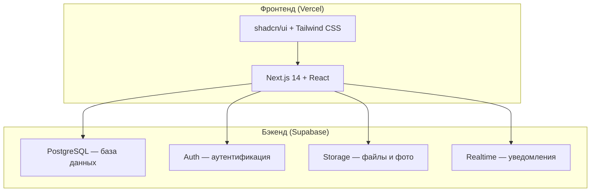

# Технологический стек

## Почему именно эти технологии?

Стек выбран по принципу **минимальной сложности при максимальном результате**. Каждая технология имеет бесплатный уровень и огромное сообщество.

## Архитектура

## Детали стека

### Фронтенд

| Технология | Версия | Назначение |
|-----------|--------|------------|
| **Next.js** | 14+ | React-фреймворк с SSR, роутингом, API-маршрутами |
| **React** | 18+ | UI-библиотека для построения интерфейсов |
| **TypeScript** | 5+ | Типизация для надёжности кода |
| **Tailwind CSS** | 3+ | Утилитарный CSS-фреймворк |
| **shadcn/ui** | latest | Готовые UI-компоненты (таблицы, формы, модалки) |
| **Recharts** | 2+ | Графики и диаграммы для аналитики |
| **date-fns** | 3+ | Работа с датами (расписание) |

### Бэкенд (Supabase)

| Компонент | Назначение |
|-----------|------------|
| **PostgreSQL** | Реляционная БД — клиенты, абонементы, платежи |
| **Row Level Security** | Безопасность на уровне строк — каждый видит только свои данные |
| **Auth** | Регистрация/вход для администраторов и тренеров |
| **Storage** | Хранение фото клиентов и тренеров |
| **Edge Functions** | Серверная логика (уведомления, отчёты) |
| **Realtime** | Обновления в реальном времени (новые бронирования) |

### Хостинг и инфраструктура

| Сервис | Назначение | Free tier |
|--------|------------|-----------|
| **Vercel** | Хостинг фронтенда | 100 ГБ трафика/мес |
| **Supabase** | Бэкенд + БД | 500 МБ БД, 1 ГБ файлов |
| **GitHub** | Хранение кода | Безлимитно |

## Почему не другие варианты?

| Альтернатива | Почему не подходит |
|-------------|-------------------|
| WordPress + плагин | Медленно, ограниченная кастомизация, проблемы с безопасностью |
| Django / Rails | Нужен отдельный сервер ($5-20/мес), сложнее для новичка |
| Firebase | Менее удобная работа с реляционными данными |
| No-code (Bubble) | Ограничения по кастомизации, vendor lock-in, дорого при масштабировании |
